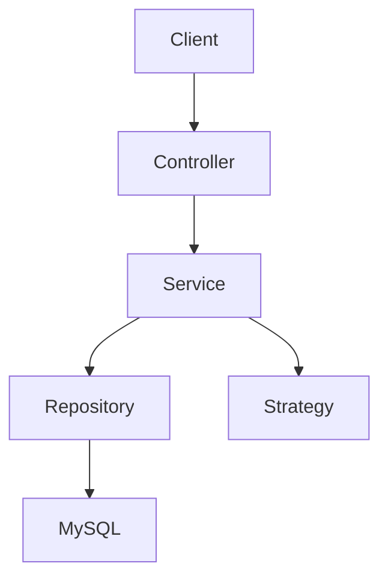

# Digital Wallet & Payment Management System

A production-style, beginner-interview-friendly Java backend for a simulated fintech wallet. It demonstrates Spring Boot REST APIs, JWT authentication, MySQL schema design, JPA relationships, transaction management, database locking, idempotent payments, cashback rewards, role-based authorization, validation, exception handling, Swagger documentation, Docker, and tests.

This is educational software only. It does not connect to real banks, UPI, cards, or payment gateways.

## Features

- User registration and login with BCrypt password hashing and JWT authentication
- One wallet per user with unique wallet numbers
- Add money, withdraw, and transfer flows using `BigDecimal`
- Atomic fund transfer with `@Transactional`
- Pessimistic wallet row locks to prevent concurrent overdrafts
- Idempotency key support so duplicate transfer requests do not double debit
- 2% transfer cashback capped at INR 100
- User transaction history with pagination, status filter, and type filter
- Admin APIs for users, wallets, and transactions
- Global JSON error responses without stack traces
- Swagger/OpenAPI at `/swagger-ui.html`
- Development seed data and Docker Compose for MySQL + app
- Integration tests covering auth, wallet, payment, idempotency, authorization, rollback, and concurrency

## Architecture



The project uses layered architecture:

- `controller`: HTTP endpoints and request validation entry points
- `service`: business rules and transactions
- `repository`: Spring Data JPA database access
- `entity`: mapped database model with relationships
- `dto`: request/response contracts, no entity exposure
- `security`: JWT filter, token service, Spring Security config
- `exception`: custom exceptions and global error handler
- `strategy`: payment strategy examples for wallet debit/credit and reward credit
- `config`: OpenAPI and seed data
- `util`: ID and money helpers

## Tech Stack

Java 21, Spring Boot 3.3.5, Spring Web, Spring Data JPA, Hibernate, Spring Security, JWT with JJWT, MySQL 8, Maven, JUnit 5, Spring Boot Test, MockMvc, H2 for tests, springdoc-openapi, Docker.

## Database Schema

`users`: id, name, email, phone, password, role, created_at, updated_at. Email and phone are unique.

`wallets`: id, wallet_number, user_id, balance, version, created_at, updated_at. One wallet per user, unique wallet number, `BigDecimal` balance.

`transactions`: id, transaction_id, sender_wallet_id, receiver_wallet_id, amount, transaction_type, status, description, created_at. Supports ADD_MONEY, TRANSFER, WITHDRAW, CASHBACK.

`payment_requests`: id, idempotency_key, sender_wallet_id, receiver_wallet_id, amount, status, transaction_id, created_at. The idempotency key is unique.

`rewards`: id, user_id, transaction_id, cashback_amount, description, created_at. Rewards point to the original transfer transaction.

Useful indexes are declared on email, phone, wallet number, transaction id, and idempotency key.

## API Endpoints

Authentication:

- `POST /api/auth/register`
- `POST /api/auth/login`

Wallet:

- `GET /api/wallet`
- `GET /api/wallet/balance`
- `POST /api/wallet/add-money`
- `POST /api/wallet/withdraw`

Payments:

- `POST /api/payments/transfer`

Transactions:

- `GET /api/transactions?page=0&size=10&status=SUCCESS&type=TRANSFER`
- `GET /api/transactions/{transactionId}`

Admin:

- `GET /api/admin/users`
- `GET /api/admin/wallets`
- `GET /api/admin/transactions`

## Authentication Flow

A user registers with name, email, phone, and password. The password is hashed using BCrypt, then a wallet is created automatically. Login authenticates through Spring Security and returns a JWT. Protected APIs require `Authorization: Bearer <token>`.

JWT secret and database credentials are read from environment variables. No secrets are hardcoded in application code.

## Payment Flow

A transfer request identifies the sender from JWT, locates the sender wallet, locates the receiver wallet by wallet number, validates amount and balance, locks wallet rows, moves money, creates a transfer transaction, applies cashback, saves a reward, and marks the payment request successful. The whole method is transactional, so a failure rolls back all balance and transaction changes.

## Idempotency

Each transfer requires an `idempotencyKey`. The system first checks whether that key already exists. If it does and has a completed transaction, the existing result is returned. If not, a new `payment_requests` row is inserted with a unique database constraint. This protects against duplicate clicks, client retries, and network retry ambiguity.

## Concurrency Handling

The project uses pessimistic locking via JPA `@Lock(LockModeType.PESSIMISTIC_WRITE)` on wallet rows. During transfer and withdrawal, the affected wallet row is locked until the database transaction commits. For transfers, both wallets are locked in ascending id order to reduce deadlock risk. This prevents two concurrent requests from both spending the same balance.

Example: if a wallet has INR 1000 and two requests try to transfer INR 700, the first successful request leaves INR 314 after INR 14 cashback. The second request then sees the updated balance and fails for insufficient funds.

## OOP and SOLID Decisions

- Encapsulation: wallet balance changes happen through `credit` and `debit`, not public setters.
- Single responsibility: controllers handle HTTP, services handle business rules, repositories handle persistence.
- Dependency inversion: controllers depend on service interfaces.
- Open/closed: payment behavior is represented by `PaymentStrategy` implementations.
- DTOs keep API contracts separate from JPA entities.

## Strategy Pattern

`PaymentStrategy` has two concrete implementations:

- `WalletPaymentStrategy`: debits sender and credits receiver for normal wallet payments.
- `RewardPaymentStrategy`: credits cashback to a receiver wallet without debiting another wallet.

This is intentionally small and practical: it separates money movement behavior without making the SDE-1 project over-engineered.

## Run Locally

1. Start MySQL 8 and create or allow creation of the `digital_wallet` database.
2. Copy `.env.example` values into your environment.
3. Use a strong `JWT_SECRET` with at least 32 characters.
4. Run:

```bash
mvn spring-boot:run
```

The app starts on `http://localhost:8080`.

## Environment Variables

```env
DB_URL=jdbc:mysql://localhost:3306/digital_wallet?createDatabaseIfNotExist=true&useSSL=false&allowPublicKeyRetrieval=true&serverTimezone=UTC
DB_USERNAME=root
DB_PASSWORD=password
JWT_SECRET=replace-with-at-least-32-random-characters
JWT_EXPIRATION_MINUTES=120
SEED_DATA_ENABLED=true
```

## Seed Credentials

When `SEED_DATA_ENABLED=true`, these demo accounts are created:

- Admin: `admin@wallet.test` / `Admin@123`
- User: `anaya@wallet.test` / `User@1234`
- User: `rohan@wallet.test` / `User@1234`
- User: `kavya@wallet.test` / `User@1234`

Seed wallets include `WALLETADMIN001`, `WALLETUSER001`, `WALLETUSER002`, and `WALLETUSER003`.

## Running Tests

```bash
mvn test
```

Tests run with H2 in MySQL compatibility mode and seed data disabled.

## Swagger

Run the application, then open:

`http://localhost:8080/swagger-ui.html`

## Docker

```bash
docker compose up --build
```

This starts MySQL and the Spring Boot application. The app container receives database and JWT configuration through environment variables in `docker-compose.yml`.

## Example Requests

Register:

```http
POST /api/auth/register
Content-Type: application/json

{"name":"Demo User","email":"demo@wallet.test","phone":"9000000099","password":"Password1"}
```

Login:

```http
POST /api/auth/login
Content-Type: application/json

{"email":"demo@wallet.test","password":"Password1"}
```

Transfer:

```http
POST /api/payments/transfer
Authorization: Bearer <jwt>
Content-Type: application/json

{"receiverWalletNumber":"WALLETUSER002","amount":500.00,"description":"Payment","idempotencyKey":"PAY-123456"}
```

Example transfer response:

```json
{
  "transactionId": "TXN1788181532151KEXWTI",
  "status": "SUCCESS",
  "amount": 500.00,
  "cashback": 10.00,
  "senderWallet": "WALLETUSER001",
  "receiverWallet": "WALLETUSER002",
  "timestamp": "2026-08-31T13:05:32.151Z"
}
```

Example error response:

```json
{
  "timestamp": "2026-08-31T13:05:43.548Z",
  "status": 400,
  "error": "INSUFFICIENT_BALANCE",
  "message": "Insufficient wallet balance",
  "path": "/api/payments/transfer",
  "validationErrors": null
}
```

## Future Improvements

- Add Flyway or Liquibase migrations
- Add refresh tokens and token revocation
- Add account lockout for repeated failed logins
- Add audit log tables for admin actions
- Add Testcontainers for MySQL integration tests
- Add CI pipeline with Maven test and Docker build
